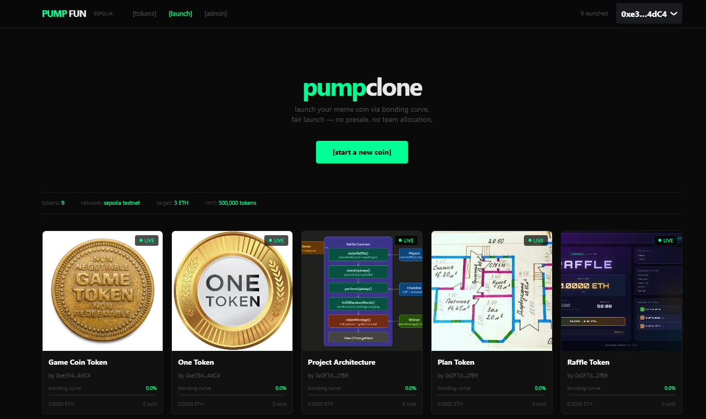
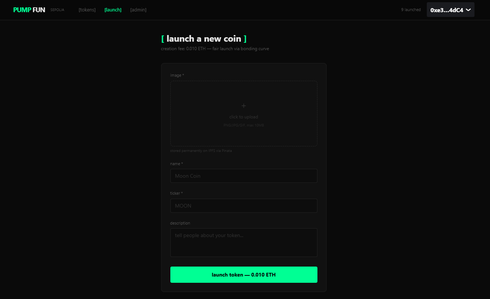
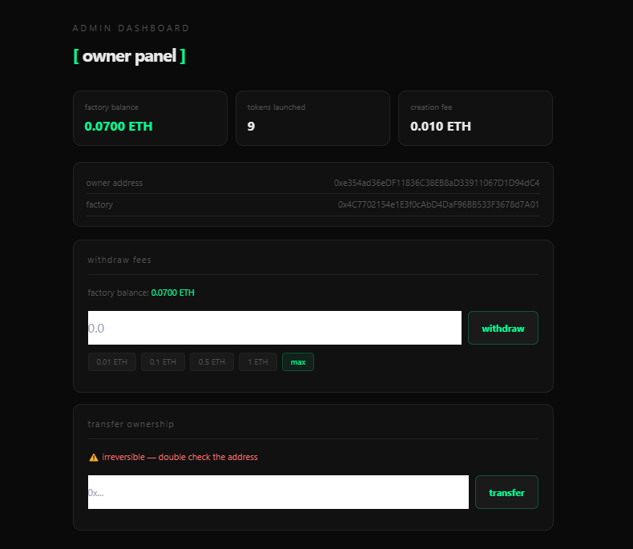
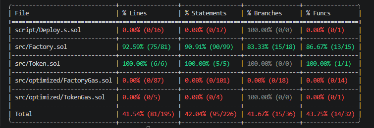

# PumpClone — Bonding Curve Token Launchpad

> A portfolio-grade, fully on-chain token launchpad inspired by PumpFun — anyone can launch an ERC20 token with a linear bonding curve, trade it permissionlessly, and graduate it to a liquidity pool. No presale. No team allocation. No admin can pick winners. The contract enforces every rule.

[](https://fun-pump.vercel.app)
[](https://sepolia.etherscan.io/address/0x4C7702154e1E3f0cAbD4DaF96BB533F3678d7A01)
[](https://sepolia.etherscan.io/address/0x4C7702154e1E3f0cAbD4DaF96BB533F3678d7A01#code)
[](https://github.com/GOLIBJON-developer/pumpclone/actions/workflows/test.yml)

**Live:** https://fun-pump.vercel.app  
**Contract:** [`0x4C7702154e1E3f0cAbD4DaF96BB533F3678d7A01`](https://sepolia.etherscan.io/address/0x4C7702154e1E3f0cAbD4DaF96BB533F3678d7A01)

---

## Screenshots

### Home — Token Grid

*All launched tokens with live bonding curve progress bars, ETH raised, and tokens sold.*

### Launch Token

*Any connected wallet can create a token — name, ticker, image (uploaded to IPFS), description, and a 0.01 ETH creation fee.*

### Owner Dashboard

*When the deployer wallet is connected, an admin panel appears with fee withdrawal and ownership transfer controls.*

### Test Coverage

*Full test suite across unit, integration, and fuzz tests — all passing.*

---

## Table of Contents

- [What It Does](#what-it-does)
- [Why I Built This](#why-i-built-this)
- [How It Works](#how-it-works)
- [Architecture](#architecture)
- [Smart Contracts](#smart-contracts)
  - [Deployed Address](#deployed-address)
  - [Factory.sol](#factorysol)
  - [Token.sol](#tokensol)
  - [Security Fixes Applied](#security-fixes-applied)
  - [Gas-Optimized Version](#gas-optimized-version)
  - [Production Code (Commented)](#production-code-commented)
- [Bonding Curve](#bonding-curve)
- [Frontend](#frontend)
  - [User Features](#user-features)
  - [Owner Features](#owner-features)
  - [Implementation Notes](#implementation-notes)
- [IPFS & Image Storage](#ipfs--image-storage)
- [Testing](#testing)
  - [Test Coverage](#test-coverage)
  - [Running Tests](#running-tests)
- [CI / CD](#ci--cd)
- [Local Development](#local-development)
- [Deployment Guide](#deployment-guide)
- [Project Structure](#project-structure)
- [Known Limitations](#known-limitations)
- [Lessons Learned](#lessons-learned)
- [Security](#security)
- [Tech Stack](#tech-stack)
- [Acknowledgements](#acknowledgements)

---

## What It Does

PumpClone is a trustless on-chain token launchpad where:

1. Anyone pays a 0.01 ETH creation fee → Factory deploys a new ERC20 token with 1,000,000 supply
2. Buyers purchase tokens through a linear bonding curve — price deterministically increases with every purchase
3. When the curve fills (3 ETH raised **or** 500,000 tokens sold), the sale automatically closes
4. The creator calls `deposit()` to receive the raised ETH and remaining tokens
5. In production, this graduation step would seed a Uniswap V3 liquidity pool

There is no centralized server. There is no randomness. The smart contract enforces every pricing rule.

---

## Why I Built This

I built this project to understand how real DeFi primitive contracts work end-to-end: how bonding curves price tokens mathematically, how a factory pattern deploys contracts on demand, how CEI pattern and reentrancy guards protect against attacks, and how to build a frontend that reads and writes live blockchain state.

The specific problems I wanted to solve:

- **Fair launch mechanics** — bonding curve ensures early buyers get a better price as a reward for taking risk, not because of a presale whitelist
- **Self-auditing** — after initial implementation I reviewed the contract myself and identified 6 security issues (documented in [Security Fixes Applied](#security-fixes-applied))
- **Gas optimization** — a parallel `FactoryGas.sol` demonstrates packed struct layout and assembly patterns achieving 11–18% gas reduction
- **Portfolio depth** — the production Uniswap V3 integration code is fully written and commented inside the contract, ready to be enabled

---

## How It Works

```
1. Creator sends 0.01 ETH → Factory.create()
         |
         ▼
2. Factory deploys Token.sol (1M supply minted to Factory)
   TokenSale struct initialized: sold=0, raised=0, isOpen=true
         |
         ▼
3. Buyers call Factory.buy(token, amount, maxCost)
   Price = getCost(sold) × amount
   sold += amount, raised += price
   Token.transfer(buyer, amount)
         |
         ▼
4. When raised ≥ 3 ETH  OR  sold ≥ 500k tokens:
   isOpen = false  →  SaleClosed event emitted
         |
         ▼
5. Creator calls Factory.deposit(token)
   Remaining tokens + raised ETH → creator wallet
   (production: → Uniswap V3 liquidity pool)
```

**Two graduation conditions — either triggers closure:**

| Condition | Threshold | Meaning |
|---|---|---|
| ETH raised | ≥ 3 ETH | Market demand filled the curve by value |
| Tokens sold | ≥ 500,000 | 50% of total supply distributed |

---

## Architecture

```
+--------------------------------------------------+
|              Next.js 15 Frontend                 |
|   Wagmi v2  Viem  RainbowKit  TanStack Query     |
|                                                  |
|  /                Home — token grid              |
|  /create          Launch form + IPFS upload      |
|  /token/[addr]    Detail page + buy panel        |
|  /admin           Owner dashboard                |
|                                                  |
|  useFactory.ts    All contract hooks (read+write)|
|  lib/pinata.ts    IPFS upload via Pinata V3 API  |
+------------------+-------------------------------+
                   | JSON-RPC (Alchemy Sepolia)
+------------------v-------------------------------+
|              Factory.sol  (Sepolia)              |
|                                                  |
|  create()    buy()    deposit()    withdraw()     |
|  getSale()   getCost()   estimateCost()           |
|  getTokensPaginated()    getSaleProgress()        |
+--------+-----------------------+-----------------+
         |
+--------v---------+
|   Token.sol      |
|   ERC20          |
|   factory (imm.) |
|   creator (imm.) |
|   imageURI       |
+------------------+
```

---

## Smart Contracts

### Deployed Address

| Network | Address | Status |
|---|---|---|
| Sepolia | [`0x4C7702154e1E3f0cAbD4DaF96BB533F3678d7A01`](https://sepolia.etherscan.io/address/0x4C7702154e1E3f0cAbD4DaF96BB533F3678d7A01) | ✅ Verified |

Contract source is publicly verified on Etherscan — every line of logic is auditable by anyone.

---

### Factory.sol

The core contract managing token creation, bonding curve sales, and graduation.

**Constants:**

| Constant | Value | Description |
|---|---|---|
| `TARGET` | 3 ETH | ETH graduation threshold |
| `TOKEN_LIMIT` | 500,000 tokens | Token count graduation threshold |
| `TOTAL_SUPPLY` | 1,000,000 tokens | Total supply per deployed token |
| `MIN_BUY` | 1 token | Minimum purchase per transaction |
| `MAX_BUY` | 10,000 tokens | Maximum purchase per transaction |
| `FLOOR` | 0.0001 ETH | Minimum price per token |
| `STEP` | 0.0001 ETH | Price increase per increment |
| `INCREMENT` | 10,000 tokens | Tokens between price steps |
| `fee` | 0.01 ETH | Creation fee (immutable, set at deploy) |

**Public functions:**

```solidity
// Deploy a new ERC20 token with bonding curve
function create(
    string memory _name,
    string memory _symbol,
    string memory _imageURI,       // "ipfs://Qm..."
    string memory _description
) external payable returns (address tokenAddr)

// Buy tokens from the bonding curve
// _maxCost = 0 → slippage check skipped
function buy(
    address _token,
    uint256 _amount,
    uint256 _maxCost               // slippage protection
) external payable

// Graduate: send raised ETH + remaining tokens to creator
// Only creator or owner; only after isOpen = false
function deposit(address _token) external

// Owner: withdraw accumulated creation fees
function withdraw(uint256 _amount) external

// View: price per token at a given sold amount
function getCost(uint256 _sold) public pure returns (uint256)

// View: cost to buy _amount tokens from current state
function estimateCost(uint256 _sold, uint256 _amount) external pure returns (uint256)

// View: full TokenSale struct by token address
function getSale(address _token) external view returns (TokenSale memory)

// View: paginated token list for frontend
function getTokensPaginated(uint256 _offset, uint256 _limit) external view returns (TokenSale[] memory)
```

**Events:**

```solidity
event TokenCreated(address indexed token, address indexed creator, string name, string symbol, string imageURI, uint256 timestamp);
event TokenPurchased(address indexed token, address indexed buyer, uint256 amount, uint256 price, uint256 totalSold, uint256 totalRaised);
event SaleClosed(address indexed token, uint256 totalRaised, uint256 totalSold);
event TokenGraduated(address indexed token, address indexed creator, uint256 ethAmount, uint256 tokenAmount);
event Withdrawn(address indexed owner, uint256 amount);
event OwnershipTransferred(address indexed previousOwner, address indexed newOwner);
```

**Custom errors** (cheaper than revert strings — ~50 gas each):

```solidity
error Factory__InsufficientFee();
error Factory__SaleClosed();
error Factory__AmountTooLow();
error Factory__AmountExceeded();
error Factory__InsufficientETH();
error Factory__SlippageExceeded(uint256 required, uint256 maxAllowed);
error Factory__TargetNotReached();
error Factory__AlreadyDeposited();
error Factory__NotAuthorized();
error Factory__NotOwner();
error Factory__ETHTransferFailed();
error Factory__ZeroAddress();
error Factory__InvalidToken();
```

---

### Token.sol

Standard ERC20 deployed by Factory on each `create()` call. Entire supply is minted to Factory at deploy time and distributed through bonding curve purchases.

```solidity
contract Token is ERC20 {
    address public immutable factory;   // set at deploy, never changes
    address public immutable creator;   // token creator's wallet
    string  public imageURI;            // "ipfs://Qm..."
    string  public description;
}
```

Why mint to Factory and not to creator?  
If tokens were minted to the creator, they could immediately dump them on buyers entering the bonding curve. Minting to Factory ensures tokens are only released through the curve at the current market price.

---

### Security Fixes Applied

Six vulnerabilities identified and patched during self-review:

| # | Bug | Impact | Fix |
|---|---|---|---|
| `FIX-1` | `deposit()` callable multiple times | Creator could drain Factory twice — second call transfers 0 tokens but might re-send ETH from another sale | Added `deposited` bool to struct; second call reverts with `Factory__AlreadyDeposited` |
| `FIX-2` | Anyone could call `deposit()` | Any external address could trigger graduation and redirect funds | Added `msg.sender == sale.creator \|\| msg.sender == owner` check |
| `FIX-3` | Excess ETH not refunded on `buy()` | Overpayments silently kept by Factory | After token transfer, `msg.value - price` returned to caller |
| `FIX-4` | No slippage protection | Frontrunners could push price up before a pending transaction executes | Added `_maxCost` parameter; reverts with `Factory__SlippageExceeded(required, maxAllowed)` if price exceeded |
| `FIX-5` | Zero address `buy()` crash | Calling `buy(address(0), ...)` caused confusing low-level reverts | Explicit `if (_token == address(0)) revert Factory__InvalidToken()` guard |
| `FIX-6` | No ownership transfer | Owner wallet permanently locked — no recovery if key is lost | Added `transferOwnership(address)` with zero-address guard |

---

### Gas-Optimized Version

`src/optimized/FactoryGas.sol` is a parallel implementation with identical logic but storage-optimized layout:

**Struct packing — slots reduced from 7+ to 3:**

```
Standard TokenSale:              Gas-optimized TokenSale:
  address token    → slot 0        address token     → slot 0  (20 bytes)
  string name      → slot 1+       address creator   → slot 1  (20 bytes)
  string imageURI  → slot 2+       bool isOpen       → slot 1  (1 byte, packed)
  address creator  → slot 3        bool deposited    → slot 1  (1 byte, packed)
  uint256 sold     → slot 4        uint128 sold      → slot 2  (16 bytes)
  uint256 raised   → slot 5        uint128 raised    → slot 2  (16 bytes, packed)
  bool isOpen      → slot 6
  bool deposited   → slot 7
```

**Additional optimizations:**

| Technique | Savings |
|---|---|
| Struct: 7+ slots → 3 slots | ~5,000 gas per `buy()` (sold+raised = 1 SSTORE) |
| `name`/`imageURI` in events only, not storage | ~40,000 gas per `create()` |
| `calldata` strings vs `memory` | ~3,000 gas per `create()` |
| Assembly ETH transfers | ~100 gas per transfer |
| `unchecked` arithmetic in safe paths | ~200 gas per op |
| Hot storage reads cached to memory | ~200 gas per read |

**Estimated savings:**

| Function | Factory.sol | FactoryGas.sol | Reduction |
|---|---|---|---|
| `create()` | ~380k gas | ~340k gas | **~11%** |
| `buy()` | ~95k gas | ~78k gas | **~18%** |
| `deposit()` | ~65k gas | ~55k gas | **~15%** |

> **Portfolio note:** `Factory.sol` is deployed — readable and audit-friendly. `FactoryGas.sol` is included to demonstrate gas optimization knowledge. In production, the gas version would be the right choice.

---

### Production Code (Commented)

Both contracts contain fully written production upgrade code inside comments, tagged and explained:

| Tag | Feature | What it does |
|---|---|---|
| `[PROD-1]` | Uniswap V3 liquidity | `createAndInitializePoolIfNecessary` + `addLiquidity` in `deposit()` instead of direct transfer |
| `[PROD-2]` | `sqrtPriceX96` calculation | Derives Uniswap V3 initial price from the bonding curve's final price in Q64.96 fixed-point format |
| `[PROD-3]` | EIP-1167 Minimal Proxy | Clone pattern for Token deployment — reduces deploy cost from ~3M gas to ~200k gas per token (~85% savings) |
| `[PROD-4]` | Creator royalty fee | Splits raised ETH: percentage to creator at graduation, remainder into Uniswap pool |

Enabling any of these requires uncommenting the relevant block and adding the corresponding interface imports.

---

## Bonding Curve

Linear step function — price increases by `STEP` every `INCREMENT` tokens sold:

```
price = FLOOR + STEP × ⌊sold / INCREMENT⌋

FLOOR     = 0.0001 ETH per token
STEP      = 0.0001 ETH per token  
INCREMENT = 10,000 tokens
```

**Price table:**

| Tokens sold | Price per token | Cumulative ETH to reach |
|---|---|---|
| 0 | 0.0001 ETH | — |
| 10,000 | 0.0002 ETH | ~1 ETH |
| 50,000 | 0.0006 ETH | ~15 ETH |
| 100,000 | 0.0011 ETH | ~55 ETH |
| 490,000 | 0.0050 ETH | ~1,225 ETH |

**Properties:**
- Deterministic — no oracle, no admin input, fully on-chain
- Monotonically non-decreasing — price never falls
- Early participants always get a better price than later ones
- `estimateCost(sold, amount)` view function for zero-cost frontend price quotes

---

## Frontend

**Live:** [https://fun-pump.vercel.app](https://fun-pump.vercel.app)

Built with Next.js 15 App Router, Wagmi v2, Viem, and RainbowKit.

### User Features

- Connect any EVM wallet (MetaMask, WalletConnect, Coinbase Wallet, etc.)
- Browse all launched tokens in a responsive grid — live progress bars, ETH raised, tokens sold
- Click any token to see its detail page: bonding curve chart, stats, buy panel
- Enter token amount manually or use quick-select buttons (100, 500, 1000, 5000, 10000)
- Real-time cost estimate from `estimateCost()` — no wallet popup until buy
- Excess ETH automatically refunded after every purchase
- **Graduate Token** button appears for creator after sale closes
- `/admin` route: owner sees factory balance, fee withdrawal, ownership transfer

### Owner Features

The admin panel only renders when the deployer wallet is connected — verified against `factory.owner()` on-chain, no hardcoded address:

- **Factory balance** — live on-chain ETH balance (accumulated creation fees)
- **Withdraw** — input field + quick amounts (0.01, 0.1, 0.5, 1 ETH, max)
- **Transfer Ownership** — double-confirm pattern: first click shows warning, second click sends transaction

### Implementation Notes

- `useTokensPaginated(0, 60)` fetches up to 60 tokens per page — pagination-ready for large sets
- `useSale(token)` polls every 4 seconds for real-time buy count updates without event subscriptions
- `useEstimateCost(sold, amount)` queries `estimateCost()` directly — always matches what the contract will charge
- `buy()` called with `_maxCost = 0` by default — to enable slippage protection, pass the `estimatedCost` value as `_maxCost`
- RainbowKit `darkTheme` configured with `#00ff94` accent to match the UI
- All images loaded via `ipfs.io` public gateway — no authentication required for public-pinned files

---

## IPFS & Image Storage

Images are stored permanently on IPFS via [Pinata](https://pinata.cloud). The flow:

```
User selects image file
         |
         ▼
Browser → POST https://uploads.pinata.cloud/v3/files
         (Authorization: Bearer PINATA_JWT, network: public)
         |
         ▼
Pinata returns CID: "bafybei..."
         |
         ▼
imageURI = "ipfs://bafybei..." passed to Factory.create()
         |
         ▼
CID stored on-chain in TokenSale.imageURI forever
         |
         ▼
Frontend displays:
https://ipfs.io/ipfs/bafybei...
```

**Why IPFS instead of on-chain?**  
Storing raw image bytes on Ethereum would cost thousands of dollars per image in gas. IPFS provides permanent, content-addressed storage — the CID is a cryptographic hash of the file content. If the file changes, the CID changes. It is immutable by design.

**Why Pinata V3 API?**  
The legacy `pinFileToIPFS` endpoint uses basic JWT auth but suffers from CORS issues when called directly from a browser. The V3 `/files` endpoint is the current Pinata standard and works correctly with browser-side requests when files are uploaded as `network: "public"`.

> Files **must** be pinned as public on Pinata for the `ipfs.io` gateway to serve them without authentication tokens.

---

## Testing

### Test Coverage


### Test Suite

```
contracts/test/
├── unit/
│   └── Factory.t.sol              30+ unit tests
├── integration/
│   └── FactoryIntegration.t.sol   Full lifecycle scenarios
└── fuzz/
    └── FactoryFuzz.t.sol          Property-based fuzz tests (1000 runs each)
```

### Coverage by Area

| Area | What is verified |
|---|---|
| `create()` | Fee validation, supply minting to Factory, event emission, multiple independent tokens, struct initial state |
| `getCost()` | Floor value, one-increment step, five-increment step, linearity, always positive |
| `buy()` | Success path, `AmountTooLow`, `AmountExceeded`, `InsufficientETH`, excess ETH refund, exact ETH no refund, slippage revert, slippage zero skipped, zero-address guard, price increases across rounds, closes at TOKEN_LIMIT, reverts on closed sale |
| `deposit()` | `[FIX-1]` double deposit reverts, `[FIX-2]` stranger reverts, `[FIX-2]` buyer reverts, owner can deposit, creator can deposit, factory balance zero after, `deposited` flag set |
| `withdraw()` | Owner success, non-owner reverts |
| `transferOwnership()` | Success, zero address reverts, non-owner reverts |
| Pagination | Correct page sizes, out-of-bounds clamp |
| Supply conservation | `factory.balance + buyer.balance == TOTAL_SUPPLY` after any buy |
| **Fuzz: `getCost()` always ≥ FLOOR** | Any `sold ∈ [0, 1M ether]` |
| **Fuzz: `getCost()` monotone** | Any `a ≤ b` |
| **Fuzz: underpay reverts** | Any valid amount, price - 1 wei |
| **Fuzz: correct token amount** | Any valid amount, exact price |
| **Fuzz: refund is exact** | Any `(amount, extra)` combination |
| **Fuzz: slippage reverts** | Any `price > maxCost` |
| **Fuzz: create low fee** | Any fee below threshold |
| **Fuzz: tiny amount** | Any `amount < 1 ether` |
| **Fuzz: large amount** | Any `amount > 10,000 ether` |
| **Fuzz: unauthorized deposit** | Any non-creator, non-owner address |
| **Fuzz: double deposit** | Any caller, always reverts after first |
| Integration: full lifecycle | create → multi-buyer → graduation → deposit → double deposit reverts |
| Integration: price non-decreasing | 10 buy rounds, price ≥ previous price each round |
| Integration: independent token state | Buy from A, verify B and C unaffected |
| Integration: owner fee collection | 5 tokens × 0.01 ETH → owner withdraws exactly |
| Integration: frontrun slippage | Carol buys before Bob → Bob's old maxCost reverts |
| Integration: multiple overpayers | buyer1 150% overpay, buyer2 300% overpay — both refunded correctly |

### Running Tests

```bash
# All tests
make test

# Unit tests only
make test-unit

# Integration tests
make test-integration

# Fuzz tests (5000 runs)
make test-fuzz

# Gas report
make test-gas

# HTML coverage report (requires lcov)
make coverage
open coverage/index.html
```

---

## CI / CD

GitHub Actions runs automatically on every push and pull request to `main`:

```yaml
- forge install
- forge build --sizes
- forge test -v
- forge snapshot    # gas baseline saved as artifact
```

The CI badge at the top of this README reflects the latest run status.

---

## Local Development

### Prerequisites

- [Foundry](https://book.getfoundry.sh/getting-started/installation) — `curl -L https://foundry.paradigm.xyz | bash && foundryup`
- [Node.js 20+](https://nodejs.org)
- Sepolia ETH from a faucet (e.g. [sepoliafaucet.com](https://sepoliafaucet.com))
- [WalletConnect Cloud](https://cloud.walletconnect.com) project ID
- [Pinata](https://pinata.cloud) account (free tier sufficient)

### Setup

```bash
git clone https://github.com/GOLIBJON-developer/pumpclone
cd pumpclone

# Foundry dependencies
cd contracts
forge install

# Frontend dependencies
cd ../frontend
npm install
```

### Run locally against Anvil

```bash
# Terminal 1 — start local chain
anvil

# Terminal 2 — deploy contracts
cd contracts
make deploy

# Note the deployed Factory address, paste into frontend/.env.local

# Terminal 3 — start frontend
cd frontend
cp .env.local.example .env.local
# Fill in NEXT_PUBLIC_FACTORY_ADDRESS with Anvil address
npm run dev
# Open http://localhost:3000
```

---

## Deployment Guide

### Environment Variables

**`contracts/.env`:**
```env
SEPOLIA_RPC_URL=https://eth-sepolia.g.alchemy.com/v2/YOUR_KEY
ETHERSCAN_API_KEY=YOUR_KEY
ACCOUNT=your-keystore-wallet-name    # cast wallet import
DEPLOYER_ADDRESS=0xYourWalletAddress
```

**`frontend/.env.local`:**
```env
NEXT_PUBLIC_FACTORY_ADDRESS=0x4C7702154e1E3f0cAbD4DaF96BB533F3678d7A01
NEXT_PUBLIC_RPC_URL=https://eth-sepolia.g.alchemy.com/v2/YOUR_KEY
NEXT_PUBLIC_WALLETCONNECT_PROJECT_ID=YOUR_PROJECT_ID
NEXT_PUBLIC_PINATA_JWT=eyJhbGciOiJ...
```

### Import wallet keystore (once)

```bash
cast wallet import myWallet --interactive
# Enter private key when prompted, set a password
```

### Deploy contracts

```bash
cd contracts
make deploy-sepolia
# Deploys Factory, verifies on Etherscan automatically
```

### Deploy frontend

```bash
cd frontend
npm run build    # verify build succeeds locally first

# Vercel
npm i -g vercel
vercel --prod
```

Or connect the GitHub repo at [vercel.com/new](https://vercel.com/new):
1. Set **Root Directory** to `frontend`
2. Add all `NEXT_PUBLIC_*` env vars in Vercel project settings

---

## Project Structure

```
pumpclone/
│
├── contracts/
│   ├── src/
│   │   ├── Factory.sol                  Core launchpad (readable, auditable)
│   │   ├── Token.sol                    ERC20 deployed per token creation
│   │   └── optimized/
│   │       ├── FactoryGas.sol           Gas-optimized Factory (packed structs, assembly)
│   │       └── TokenGas.sol            Gas-optimized Token (metadata in events only)
│   │
│   ├── script/
│   │   ├── DeployFactory.s.sol          Cyfrin-style deploy script
│   │   └── HelperConfig.s.sol           Chain config (mainnet / sepolia / anvil)
│   │
│   ├── test/
│   │   ├── unit/Factory.t.sol           30+ unit tests, all fixes covered
│   │   ├── integration/FactoryIntegration.t.sol   6 lifecycle scenarios
│   │   └── fuzz/FactoryFuzz.t.sol       10 property-based fuzz tests
│   │
│   ├── foundry.toml
│   ├── Makefile
│   └── .env.example
│
├── frontend/
│   ├── app/
│   │   ├── layout.tsx                   Root layout with Web3Provider
│   │   ├── globals.css                  Design system (Space Mono, CSS variables)
│   │   ├── page.tsx                     Home — token grid
│   │   ├── create/page.tsx              Launch token form
│   │   ├── token/[address]/page.tsx     Token detail + buy panel + chart
│   │   └── admin/page.tsx               Owner dashboard
│   │
│   ├── components/
│   │   ├── Header.tsx                   Sticky nav with wallet connect
│   │   ├── TokenCard.tsx                Token card with progress bar
│   │   └── BondingCurveChart.tsx        Recharts step-function chart
│   │
│   ├── hooks/
│   │   └── useFactory.ts                All contract reads + writes (wagmi)
│   │
│   ├── lib/
│   │   ├── abis.ts                      Factory ABI as const (from forge build)
│   │   ├── config.ts                    Constants, helpers, ipfsToHttp
│   │   └── pinata.ts                    IPFS upload via Pinata V3 API
│   │
│   ├── providers/
│   │   └── Web3Provider.tsx             Wagmi + RainbowKit + TanStack Query
│   │
│   └── .env.local.example
│
├── .github/
│   └── workflows/
│       └── test.yml                     CI: build + test + gas snapshot
│
├── img/
│   ├── UI.png
│   ├── launchtoken.png
│   ├── owner-ui.png
│   └── coverage.png
│
└── README.md
```

---

## Known Limitations

**No sell function in bonding curve phase**

By design — this matches PumpFun's model. During the bonding curve period, tokens can only be bought, not sold. This prevents rug pulls (creator cannot dump) and ensures the curve fills monotonically. After graduation, Uniswap V3 would provide full buy/sell liquidity.

**Graduation sends to creator, not Uniswap**

This is a deliberate simplification for portfolio/testnet deployment. The production Uniswap V3 code is fully written and commented inside `deposit()` — tagged `[PROD-1]` and `[PROD-2]`. Enabling it requires uncommenting those blocks and adding the Uniswap interface imports.

**No token burn mechanism**

Tokens not sold during the bonding curve are transferred to the creator at graduation. In production, these would typically be burned or added to the Uniswap LP position.

**Single image per token, no metadata update**

`imageURI` is set at creation and stored in contract storage. There is no function to update it — intentional, as mutability would break the trust model (creator could swap to a different image after buyers entered).

**IPFS propagation delay**

Newly uploaded images may take 30–60 seconds to be accessible via the `ipfs.io` public gateway as the content propagates through the IPFS network. This is a property of IPFS, not the application.

---

## Lessons Learned

**CEI pattern is not optional — it is correctness**

The original implementation updated state after token transfer. This creates a reentrancy window: a malicious token contract could re-enter `buy()` before `sale.sold` is updated, effectively buying at the old price repeatedly. Moving all state updates before any external call (`Token.transfer`) closes this window entirely.

**`SafeERC20.safeTransfer` vs `transfer` — the subtle failure mode**

Standard `ERC20.transfer()` returns a `bool` that most callers ignore. Some non-standard ERC20s (USDT being the most famous) do not return a value at all — calling `.transfer()` on them does not revert but the transfer silently fails. `SafeERC20.safeTransfer()` wraps the call to check the return value and reverts if it is false or missing. For a launchpad handling arbitrary ERC20 tokens, this is not optional.

**Public mapping getters return unnamed tuples — not named structs**

Solidity auto-generates a getter for public mappings, but the return type is an unnamed tuple, not the named struct. Calling `factory.tokenToSale(addr).sold` in Solidity tests (or TypeScript frontends) does not compile — `.sold` is not a member of a tuple. The fix is a wrapper view function (`getSale(address)`) that explicitly returns the named struct type.

**`as const` ABI is required for wagmi type inference**

Passing the ABI as a plain JavaScript array to wagmi hooks works at runtime but loses TypeScript type inference — `functionName`, `args`, and return types become `any`. The `as const` assertion freezes the array literal, allowing TypeScript and wagmi to infer the exact argument and return types for each function. This catches mismatched argument types at compile time rather than runtime.

**Pinata V3 API endpoint and public file requirement**

The legacy `pinFileToIPFS` endpoint requires server-side calls to avoid CORS. The V3 `/files` endpoint supports browser-side uploads but requires files to be pinned as `network: "public"` — private files return 401 from any public gateway regardless of whether a gateway token is provided. This is a Pinata account-level setting, not a request-level header.

**`suppressHydrationWarning` on `<html>` and `<body>`**

Wallet extensions (MetaMask, Phantom, etc.) inject attributes into the DOM before React hydrates. This causes a server/client HTML mismatch and React's hydration warning in development. Adding `suppressHydrationWarning` to `<html>` and `<body>` in `layout.tsx` tells React to expect this difference on those elements specifically without suppressing real hydration bugs elsewhere in the component tree.

---

## Security

| Concern | Mitigation |
|---|---|
| Reentrancy | CEI pattern enforced throughout; `nonReentrant` modifier on `buy()` and `deposit()` |
| Creator rug-pull | Entire supply minted to Factory, not creator; creator only receives funds after graduation |
| Double graduation | `deposited` bool flag; second `deposit()` call reverts with `Factory__AlreadyDeposited` |
| Unauthorized graduation | `msg.sender == creator \|\| msg.sender == owner` enforced |
| Slippage / frontrunning | `_maxCost` parameter with `Factory__SlippageExceeded` custom error |
| Unsafe ERC20 transfer | `SafeERC20.safeTransfer` from OpenZeppelin — checks return values |
| ETH refund failure | Explicit check on `.call{value}()` return; reverts with `Factory__ETHTransferFailed` |
| Zero address operations | Guards on `buy()` and `transferOwnership()` |
| Private key exposure | Foundry keystore (`cast wallet import`) — no raw keys in env files or source code |
| Source code trust | Contract verified on Etherscan — every line publicly auditable |

---

## Tech Stack

| Layer | Technology | Version |
|---|---|---|
| Smart Contract | Solidity | 0.8.20 |
| Dev Framework | Foundry (forge, cast, anvil) | latest |
| Token Standard | OpenZeppelin ERC20 | v5.x |
| Reentrancy Protection | OpenZeppelin ReentrancyGuard | v5.x |
| Safe Transfers | OpenZeppelin SafeERC20 | v5.x |
| Frontend | Next.js | 15.2.4 |
| Language | TypeScript | 5 |
| Ethereum Hooks | Wagmi | v2.14 |
| Ethereum Library | Viem | v2.21 |
| Wallet UI | RainbowKit | v2.2 |
| Server State | TanStack Query | v5 |
| Charts | Recharts | v2.13 |
| IPFS Pinning | Pinata | V3 API |
| Hosting | Vercel | — |
| CI | GitHub Actions | — |

---

## Acknowledgements

- [PumpFun](https://pump.fun) — original bonding curve launchpad concept
- [Patrick Collins / Cyfrin](https://github.com/Cyfrin) — Foundry patterns and best practices
- [OpenZeppelin](https://openzeppelin.com) — ERC20, ReentrancyGuard, SafeERC20
- [Foundry](https://book.getfoundry.sh) — Solidity testing framework
- [Wagmi](https://wagmi.sh) / [Viem](https://viem.sh) — Ethereum React hooks
- [RainbowKit](https://rainbowkit.com) — Wallet connection UI
- [Pinata](https://pinata.cloud) — IPFS pinning service

---

<div align="center">

Built as a portfolio project · Sepolia Testnet only · Not audited · Not financial advice

[Live Demo](https://fun-pump.vercel.app) · [Contract](https://sepolia.etherscan.io/address/0x4C7702154e1E3f0cAbD4DaF96BB533F3678d7A01) · [GitHub](https://github.com/GOLIBJON-developer/pumpclone)

</div>